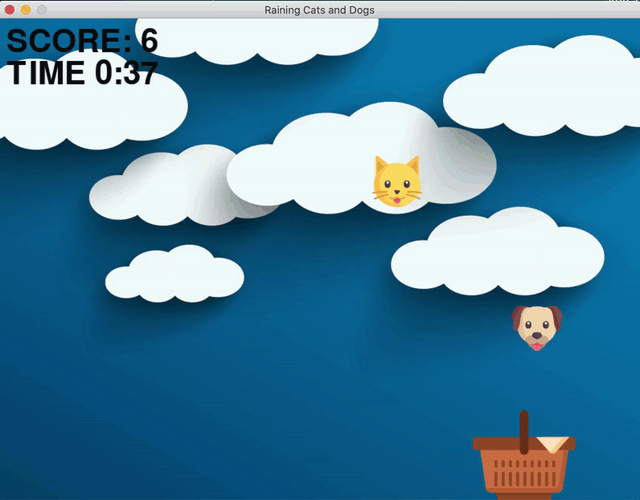

# Raining Cats & Dogs

Raining Cats & Dogs is modelled after one of my favourite games from when I was little. Recreating it brought back so many memories, hope you enjoy playing it as much as I did building it! 

### Game Rules
* Move the basket using the ⬅️ ➡️ keys
* 1 point scored for every cat or dog caught  
* Game Over if you miss a single catch 
* Don't forget to have fun! 

Happy gaming!

To learn more about Pygame, check out the resources on [GitHub - Pygame](https://github.com/pygame/pygame) & the official [Pygame](https://www.pygame.org/) website!
